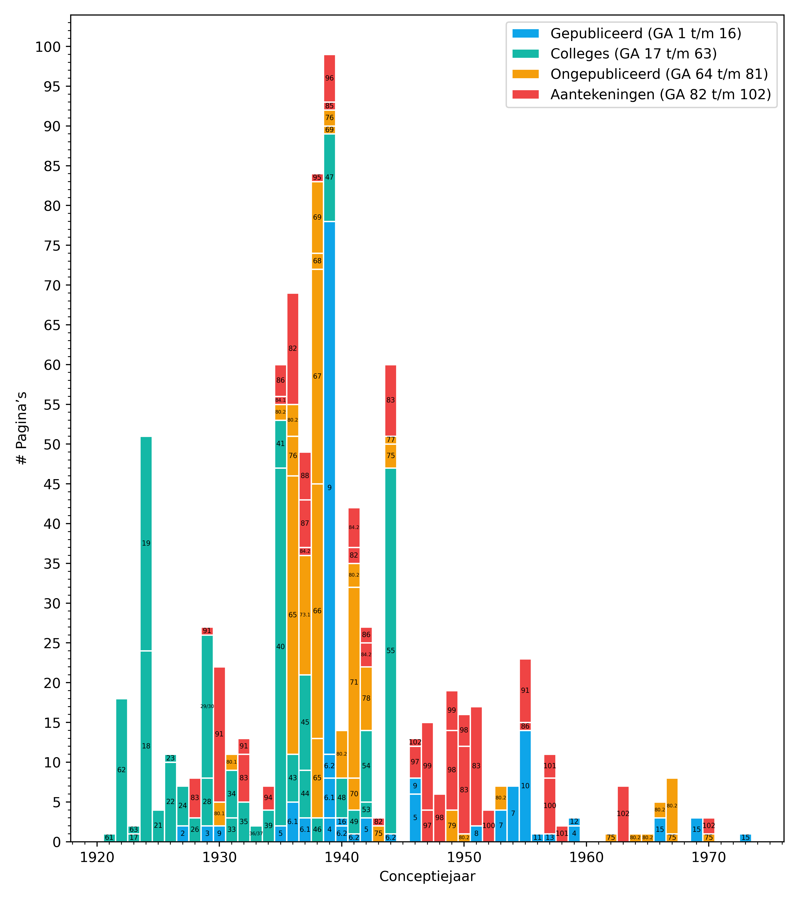

# Heideggers φύσις

Deze repository biedt een overzicht van het voorkomen van het lemma φύσις in Heideggers _Gesamtausgabe_. Hiervoor is dankbaar gebruik gemaakt van het lemma uit Patrick Unruhs [_Register zur Martin Heidegger Gesamtausgabe_](https://www.klostermann.de/Unruh-Patrick-Register-zur-Martin-Heidegger-Gesamtausgabe) uit 2017, met [enkele correcties](./index/errata.yml) en [aangevuld](./index/complement.yml) met alle delen die sinds Unruhs publicatie zijn verschenen.



## Kanttekeningen

* Niet door Unruh meegenomen: vol. 38A, 72, 80.1, 80.2, 82, 84.2, 91-93, 98-102 (14 delen)
* Niet te dateren: 
  * GA 73: Tijdspanne van ongeveer dertig jaar (*Nachwort des Herausgebers*, p. 1489)
  * GA 74
  * GA 76 (gedachten stammen uit de periode 1933 t/m 1955... wel echt een φύσις-band!)
  * GA 81 (eind jaren 30, begin jaren 40)
  * GA 91, *Denksplitter* (tweede deel): Periode van 4 decennia (*Nachwort de Herausgebers*, p. 771)

### Meerdere jaren

Een aantal werken zijn niet op een enkel jaar toe te spitsen. Voorbeelden hiervan zijn de colleges gegeven in het wintersemester (die altijd het eind van het jaar en het begin van het volgende jaar bestrijken), maar er zijn ook andere teksten waarvan de datering een reeks jaren is, en waarvaan geen preciezere datering meer te achterhalen is.  Voorbeelden zijn:

* *Beiträge* (GA 65): 1936-1938. Uit het *Nachwort des Herausgebers* blijkt dat het deel ‘Das Seyn’ uit 1938 komt, en de rest uit 1936/37 (GA 65, p. 515).
* ‘Die Geschichte des Seyns’ (GA 69, eerste deel): 1938-40

In al deze gevallen is ervoor gekozen om het eerste jaar uit de reeks aan te houden.

## Errata

In [`errata.yml`](./errata.yml) zijn de correcties op de index van Unruh aangebracht, in drie varianten:

```yaml
2:
- 282: null
5:
- 40
45:
- 137: 136f
```

In dit voorbeeld geldt:

* GA 2, p. 282 moet worden verwijderd
* GA 5, p. 40 moet worden toegevoegd
* GA 45, p. 137 moet worden vervangen door 136f.

Errata zijn bijgehouden bij het doorlopen door de referenties. Er is gemerkt dat Unruhs referentielijst een groot deel van de referenties bevat, maar ook een aardig deel over het hoofd heeft gezien. Bij de doorloop door alle referenties zijn de correcties bijgehouden, maar ook is er digitaal door de beschikbare PDF-bestanden gezocht ([2c5b57f](https://github.com/andredelft/phusis-index/commit/2c5b57ffb1d82960b4858bee97607f3e24cb8cab)). Hoewel dit een aantal extra referenties heeft opgeleverd, is ook deze digitale zoektocht niet perfect. Bijv. op GA 5, 196 wordt φύσις genoemd (Unruh heeft deze referentie), maar is door de OCR gecodeerd als ‘φύσι,ς’, waardoor de zoekopdracht hem niet ziet.

## Categorisering

We categoriseren de referenties op basis de context waarin φύσις in de passages ter sprake komen. Deze categorieën zijn weer te groeperen:

1. Antieke referenties waarin φύσις ter sprake komt
2. Vertalingen die van φύσις gegeven worden 
3. Andere begrippen of Griekse termen waar φύσις mee in verband wordt gebracht (of tegen af wordt gezet).
4. Een bepaalde variatie van φύσις ter sprake komt

We sommen hieronder de gebruikte categorieën op in de drie genoemde groepen.

### Antieke referenties

We noemen de auteur/filosoof die besproken wordt bij de hele naam, of we korten het af en specificiëren met dubbele punten steeds verder om welke referentie het gaat. Bijv. `Ari:Phy` verwijst naar de *Physica* van Aristoteles, `Ari:Phy:4` naar het vierde boek van de *Fysica*, etc. De opdeling is contextafhankelijk. `Her:123` verwijst bijvoorbeeld naar het 123e *fragment* van Heraclitus. Enkele voorbeelden:

|          Code | Toelichting                                             |
| ------------: | :------------------------------------------------------ |
|     `Her:123` | Heraclitus, fr. 123: φύσις κρύπτεσθαι φιλεῖ             |
|       `Emp:8` | Empedocles, Fr. 8                                       |
|   `Soph:Aias` | Sophokles, *Aias*                                       |
|      `Platon` | φύσις bij Plato                                         |
| `Aristoteles` | φύσις bij Aristoteles                                   |
|     `Ari:Par` | Aristoteles, Περὶ ζῴων μορίων (*De Partibus Animalium*) |
|  `Parmenides` | φύσις bij Parmenides                                    |

Er zijn ook een aantal referenties naar moderne werken:

|          Code | Toelichting                                             |
| ------------: | :------------------------------------------------------ |
|   `Kant:Vorl` | *Vorlesungen Kants über Metaphysik*                     |

### Vertalingen

|                  Code | Toelichting                     |
| --------------------: | :------------------------------ |
|  `Seienden-im-Ganzen` | Vert. als *Seiende im Ganzen*   |
| `Seiende-als-solches` | Vert. als *Seiende als solches* |
|              `ReiAuf` | Vert. als *Reine Aufgehen*      |
|              `Aufgeh` | Vert. als *Aufgehen*            |
|              `Aufgan` | Vert. als *Aufgang*             |
|              `Hervor` | Vert. als *Hervorbringen*       |
|              `Anwahr` | Vert. als *Anwähren*            |
|             `Ausgang` | Vert. als *Ausgang*             |
|             `Wiesein` | Vert. als *Wie-sein*            |
|            `Vorgehen` | Vert. als *Vorgehen*            |

### Andere begrippen

|             Code | Toelichting                       |
| ---------------: | :-------------------------------- |
|       `aletheia` | ἀλήθεια                           |
| `arche-kineseos` | ἀρχὴ κινήσεως                     |
|           `erde` | Aarde                             |
|          `einai` | εἶναι                             |
|    `Entmachtung` | *Entmachtung der* φύσις           |
|          `genos` | γένος                             |
|        `heteros` | ἕτερος (anders/verschillend-zijn) |
|           `hypo` | ὑπό                               |
|       `katholou` | καθόλου                           |
|        `kinesis` | κίνησις                           |
|          `lethe` | λήθη                              |
|          `logos` | λόγος                             |
|          `Moira` | Μοῖρα                             |
|          `moria` | μορία                             |
|          `Natur` | Natuur                            |
|          `noein` | νοεῖν                             |
|             `on` | ὄν                                |
|          `ousia` | οὐσία                             |
|         `Physik` | Physik                            |
|        `poiesis` | ποίησις                           |
|          `polis` | πόλις                             |
|         `psuche` | ψυχή                              |
|       `Seienden` | Seienden                          |
|           `Sein` | Sein                              |
|      `Seinssinn` | Seinsinn                          |
|         `techne` | τέχνη                             |
|         `thesis` | θέσις                             |
|         `timios` | τίμιος                            |
|    `Anwesenheit` | Anwesenheit                       |
|      `vorhanden` | Das immer schon vorhanden sein    |

### Variatie

|              Code | Toelichting                                 |
| ----------------: | :------------------------------------------ |
|     `phusiologoi` | φυσιολόγοι                                  |
|      `Metaphysik` | Metaphysikysik/μετὰ τὰ φύσικα               |
|         `phusika` | φυσικά                                      |
|          `phuein` | φύειν                                       |
|         `pephuke` | πέφυκε                                      |
|     `phusei-onta` | φύσει ὄντα                                  |
| `proteron-phusei` | πρότερον φύσει                              |
|        `episteme` | ἐπιστήμαι ἠθική, λογική & φυσική            |
|    `peri-phuseos` | περὶ φύσεως                                 |
|     `kata-phusin` | κατὰ φύσιν                                  |

